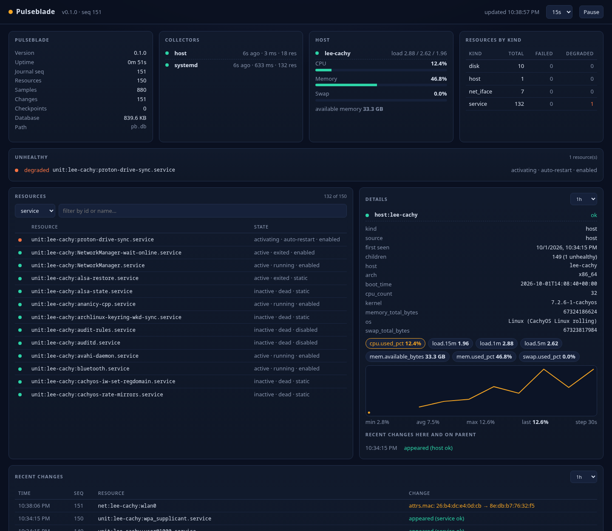

# Pulseblade


**Pulseblade** — a pulse that reveals what is moving across your infrastructure.

Pulseblade is a self-hosted infrastructure monitor built for **AI agents as the primary consumer**. A lightweight per-host **node** collects metrics and state, keeps a change journal, and exposes everything through the [Model Context Protocol](https://modelcontextprotocol.io) (MCP). Agents ask "what changed since checkpoint X?" instead of drowning in alert storms. Humans get a degraded view of the same data with no LLM involved: a built-in dashboard, a JSON API, Prometheus metrics, and `pulseblade ctl status`.

It scales in two shapes with the same MCP contract:

- **Single box** — one node, with an optional **pilot** (a local-LLM reasoning loop) watching the OS and user session.
- **Fleet** — many nodes feeding a **hub** (control node); pilots and other agents talk to the hub, nodes enforce their own action policy.

## Why

Existing tools are either human-first monitoring stacks with an agent bolted on, or agent-observability tools that watch LLMs rather than infrastructure. Pulseblade is designed the other way around:

- **MCP first** — structured, schema'd tools are the primary interface.
- **Standing, queryable state** — snapshots, checkpoints, and `changes_since` instead of human-cognitive alert floods.
- **Semantic labels and causal context** baked into telemetry.
- **Token-efficient** — a summary snapshot of a ~150-resource host is ~150 tokens; cursors and `if_changed_since` make polling nearly free; series are compact arrays; bulk JSONL export when you really want everything.
- **Useful without an LLM** — dashboard, REST API, Prometheus exposition, and a terminal status view, all from the same queries the agents use.
- **Remediation as first-class tools** (planned) — idempotent, audited, and gated by risk tier.
- **Memory** (planned) — notes and prior actions attached to resources.
- **No per-seat anything** — one binary, embedded SQLite, runs anywhere.

## Status

Milestones **M1** (single-host node) and **M1.1** (dashboard and HTTP API) — see [docs/PLAN.md](docs/PLAN.md).

| Works today | Planned |
|-------------|---------|
| Host, CPU, memory, disk, network, systemd service collectors | Logs, processes, user units; findings and memory (M2) |
| Change journal, checkpoints, `changes_since` | Gated remediation and audit chain (M3) |
| Metrics with query-time downsampling | Pilot: LLM reasoning loop, local or remote model (M4) |
| MCP over stdio and streamable HTTP | Docker, Proxmox (M5), hub (M6), Kubernetes (M7) |
| Dashboard, REST API, Prometheus `/metrics`, `ctl status` | |

## Quick start

```bash
make install            # cargo install --path crates/pulseblade

# Run this host's node: collectors, MCP at http://127.0.0.1:7171/mcp,
# dashboard at http://127.0.0.1:7171/
pulseblade node

# Or serve MCP over stdio (collects in-process unless a node already owns the database)
pulseblade mcp

# Serve an existing database without collecting (offline inspection, copied databases, demos)
pulseblade --db ./copy.db node --no-collect
```

### Connect an MCP client

Cursor (`~/.cursor/mcp.json`), HTTP against a running node:

```json
{
  "mcpServers": {
    "pulseblade": { "url": "http://127.0.0.1:7171/mcp" }
  }
}
```

Or stdio, with no daemon required:

```json
{
  "mcpServers": {
    "pulseblade": { "command": "pulseblade", "args": ["mcp"] }
  }
}
```

Use an absolute path (e.g. `~/.cargo/bin/pulseblade`, expanded) if `~/.cargo/bin` is not on the PATH your editor launches with.

### From the shell

```bash
pulseblade ctl status                  # plain-text summary: self-health, counts, unhealthy, recent changes
pulseblade ctl snapshot --detail brief # JSON, same shapes as the MCP tools
pulseblade ctl checkpoint before-deploy
pulseblade ctl changes --since before-deploy
pulseblade ctl export --since 1h > dump.jsonl
```

## MCP tools (M1)

| Tool | Purpose |
|------|---------|
| `state_snapshot` | `summary` by default: counts by kind, collector health, host key metrics, unhealthy resources, `as_of_seq`. `detail=brief\|full` for lists; `if_changed_since` for near-free polling |
| `resource_explain` | One resource: labels, attributes, parent/children, latest metrics, recent changes |
| `metrics_query` | Bounded, downsampled series as a compact `values` array (`range`, `step`, `agg`) |
| `checkpoint_create` | Name the current point in the change journal |
| `changes_since` | Changes since a checkpoint, sequence number, timestamp, or relative duration |
| `export_bulk` | JSONL dump of resources and changes for offline analysis |

The cheap agent loop is: summary snapshot, remember `as_of_seq`, poll `changes_since` or `if_changed_since`, drill down only on what changed. Measured sizes are in [docs/ARCHITECTURE.md](docs/ARCHITECTURE.md#token-efficiency).

## Dashboard and HTTP API

The node serves a read-only, LLM-free view of the same data on its HTTP port, next to `/mcp`:

| Path | What |
|------|------|
| `/` | Built-in dashboard (one self-contained HTML page, no external assets) |
| `/metrics` | Prometheus text exposition |
| `/api/v1/status` | Pulseblade self-health: version, `as_of_seq`, database path and size, per-collector last run (age, duration, ok/error, consecutive failures), resource and sample counts, uptime |
| `/api/v1/snapshot` | `state_snapshot`: `detail`, `if_changed_since`, `kind`, `query`, `labels=k=v,k2=v2`, `unhealthy_only`, `limit` |
| `/api/v1/resources/{id}` | `resource_explain` (`changes_limit`); ids may be percent-encoded or raw, e.g. `/api/v1/resources/disk:web1:/home` |
| `/api/v1/metrics` | `metrics_query`: `id`, `metric`, `range`, `step`, `agg` |
| `/api/v1/changes` | `changes_since`: `since` (default `1h`), `kind`, `prefix`, `limit`, `compact` |
| `/api/v1/checkpoints` | Checkpoints, newest first |
| `/healthz` | `ok` |

Errors are JSON `{"error": "..."}` with 400 for invalid input and 404 for unknown resources, metrics, checkpoints, or endpoints.



The dashboard shows collector status, host key metrics, counts by kind, unhealthy resources first, a filterable resource table, recent changes over a selectable window, and per-resource details with a sparkline of any metric. It refreshes every 15 seconds (pausable). Deep links work: `/?kind=service&q=ssh&select=unit:web1:sshd.service&metric=...`.

### Remote access

Everything listens on loopback by default and has no authentication of its own. Requests are only accepted when their `Host` header is loopback, the listen address, or listed in `allowed_hosts` (DNS-rebinding protection for `/mcp`, the API, and the dashboard alike). For access from other machines, put a reverse proxy with TLS and authentication in front and allow its hostname:

```toml
# pulseblade.toml
allowed_hosts = ["pulseblade.example.com"]
```

```caddyfile
pulseblade.example.com {
    basic_auth {
        admin <bcrypt hash from `caddy hash-password`>
    }
    reverse_proxy 127.0.0.1:7171
}
```

(nginx: `proxy_pass http://127.0.0.1:7171; proxy_set_header Host $host;`.) If you instead set `listen = "0.0.0.0:7171"`, add every name or `ip:port` that clients use to `allowed_hosts`, and firewall the port.

### Prometheus and Grafana

```yaml
# prometheus.yml
scrape_configs:
  - job_name: pulseblade
    scrape_interval: 15s
    static_configs:
      - targets: ["127.0.0.1:7171"]   # remote targets: add "web1:7171" to that node's allowed_hosts
```

| Series | Meaning |
|--------|---------|
| `pulseblade_up`, `pulseblade_build_info{version}`, `pulseblade_journal_seq` | Node liveness, version, journal position |
| `pulseblade_collector_up{collector}` | 1 when the last pass succeeded and is recent |
| `pulseblade_collector_last_run_timestamp_seconds`, `..._last_success_timestamp_seconds`, `..._last_duration_seconds`, `..._consecutive_failures`, `..._resources` | Per-collector detail |
| `pulseblade_resource_health{id,kind,host,...}` | **0 ok, 1 unknown, 2 degraded, 3 failed** |
| `pulseblade_<metric>{id,kind,host,...}` | Latest value of every metric, name sanitized: `cpu.used_pct` becomes `pulseblade_cpu_used_pct`, `load.1m` becomes `pulseblade_load_1m` |

Resource series also carry your semantic labels (e.g. `criticality`, `role`) when their names are valid Prometheus labels. In Grafana, add the Prometheus data source and start from queries such as:

```promql
pulseblade_resource_health >= 2                                   # degraded or failed resources
pulseblade_cpu_used_pct{kind="host"}                              # CPU per host
max by (id) (pulseblade_disk_used_pct)                            # disk fill
time() - pulseblade_collector_last_success_timestamp_seconds > 60 # stale collectors
```

### Homepage

A [Homepage](https://gethomepage.dev) `customapi` widget against the status endpoint (Homepage fetches server-side, so the hostname it uses must reach the node and be in `allowed_hosts`):

```yaml
# services.yaml
- Infrastructure:
    - Pulseblade:
        icon: mdi-heart-pulse
        href: https://pulseblade.example.com/
        widget:
          type: customapi
          url: https://pulseblade.example.com/api/v1/status
          refreshInterval: 15000
          mappings:
            - field: { resources: total }
              label: Resources
              format: number
            - field: { resources: failed }
              label: Failed
              format: number
            - field: { resources: degraded }
              label: Degraded
              format: number
            - field: samples
              label: Samples
              format: number
```

`/api/v1/snapshot` (summary detail) works too: its `total` is the number of unhealthy resources and `as_of_seq` moves whenever anything changes.

## Configuration

Optional TOML at `~/.config/pulseblade/pulseblade.toml` (or `--config`):

```toml
interval_secs = 15
retention_hours = 24
listen = "127.0.0.1:7171"
allowed_hosts = []        # extra Host header values, e.g. a reverse proxy's hostname

# Semantic labels attached to matching resource ids (`*` wildcard).
[[labels]]
match = "unit:*:sshd.service"
set = { criticality = "high", role = "access" }

[[labels]]
match = "disk:*:/"
set = { criticality = "high" }
```

State lives in `~/.local/state/pulseblade/pulseblade.db` by default (`--db` to override).

## Integrates with

- Any MCP client: Cursor, Claude, agent runtimes such as Hermes Agent, local agents on Ollama, HolmesGPT, custom scripts
- Any OpenAI-compatible endpoint as the pilot's model, local or remote: Ollama, vLLM, OpenRouter, Hermes models (planned, [#6](https://github.com/DataKnifeAI/pulseblade/issues/6))
- Prometheus and Grafana (scrape `/metrics`), Homepage and other dashboards (JSON API)
- systemd (today); Docker, Proxmox VE, Kubernetes (planned)

## Development

```bash
make help   # list targets
make ci     # fmt-check + clippy -D warnings + tests
```

Architecture: [docs/ARCHITECTURE.md](docs/ARCHITECTURE.md).

## License

Apache-2.0 — see [LICENSE](LICENSE).
