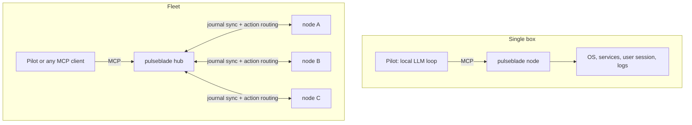
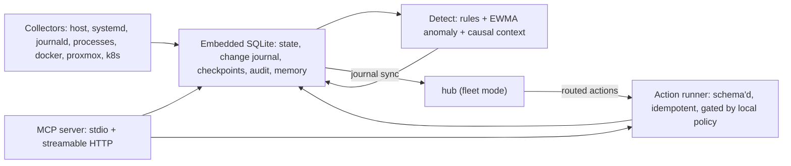

# Architecture

## Roles

Pulseblade separates three roles that "agent" would otherwise blur:

| Role | What it is | Command |
|------|------------|---------|
| **Node** | Per-host daemon: collectors, local store and change journal, action runner, MCP server | `pulseblade node` (stdio: `pulseblade mcp`) |
| **Hub** | Control node: consumes every node's journal into fleet state and serves the same MCP tools fleet-wide (M6) | `pulseblade hub` |
| **Pilot** | Optional reasoning loop: an MCP client driven by a local LLM (Ollama or any OpenAI-compatible API) that investigates findings and proposes actions (M4) | `pulseblade pilot` |

`pulseblade ctl` gives shell access to the same queries (snapshot, checkpoint, changes, export; later `approve`).

The pilot is optional and replaceable: Cursor, HolmesGPT, or a custom script can use the same tools. The monitor never embeds a model.

## Topologies

### Invariants

1. **One MCP contract at every tier.** A pilot written against a single node works unchanged against a hub. Resource ids already carry the hostname (`unit:<host>:<unit>`); the hub only adds fleet-level tools on top (`fleet_overview`).
2. **Nodes own their policy.** The hub may plan and route an action, but the node evaluates it against its own risk tiers and allow-lists before running it. A compromised hub or confused pilot can never exceed what each node permits. Approval can happen at either tier.
3. **Journals are the replication protocol.** Each node's change journal is append-only with monotonic `seq`. The hub keeps a per-node cursor and consumes changes after it; a disconnected node keeps journaling locally and the hub catches up on reconnect.
4. **Nodes need no inbound ports.** Nodes connect out to the hub to push journal entries and samples and to long-poll for routed actions.
5. **Pilots are event-driven.** On a single box the LLM competes for the CPU, GPU, and memory it observes, so the pilot wakes on findings (and on a slow heartbeat), not on every collection pass.

### Scaling the context window

A fleet of 100 nodes with ~150 resources each is ~15,000 resources. The hub's `fleet_overview` groups by semantic labels (`role`, `cluster`, `criticality`) and host, reports unhealthy items in full, and summarizes the rest as counts. Labels are therefore load-bearing in fleet mode, not decoration.

A hub can present itself as a node to a higher hub, so hub-of-hubs needs no new protocol when it is eventually needed.

## Node internals

## Crates

| Crate | Responsibility |
|-------|----------------|
| `pulseblade-core` | Schema types (`Resource`, `Sample`, `Change`, `Checkpoint`, `Finding`, `ActionSpec`, `ActionRun`, `Note`), label matching, duration parsing. Every type derives `JsonSchema`. |
| `pulseblade-store` | SQLite (`rusqlite`, bundled, WAL). Resource state, append-only change journal, checkpoints, samples with retention and query-time downsampling. |
| `pulseblade-collect` | `Collector` trait plus host (`sysinfo`) and systemd collectors; journald, processes, and user units next. Docker, Proxmox, and Kubernetes arrive behind Cargo features. |
| `pulseblade-detect` | (M2) Threshold rules and EWMA anomaly detection producing findings with causal context. |
| `pulseblade-act` | (M3) Action registry, node-local risk tiers, dry-run plans, approval gate, hash-chained audit. |
| `pulseblade-mcp` | `rmcp` server exposing the tool surface over stdio and streamable HTTP. |
| `pulseblade-pilot` | (M4) Event-driven reasoning loop over MCP using an OpenAI-compatible model endpoint. |
| `pulseblade` | CLI binary, node loop, config loading. |

## Data model

- **Resource** — anything observable. Ids are stable and hierarchical by convention: `host:<hostname>`, `disk:<hostname>:<mount>`, `net:<hostname>:<iface>`, `unit:<hostname>:<unit>`. Each carries `kind`, `labels` (semantic, from collectors and config), `attrs` (slow-moving state facts that are change-tracked), and an optional `parent`.
- **Sample** — `(resource, metric, ts, value)`. Fast-moving numbers live here, not in `attrs`, so they never generate change noise.
- **Change** — append-only journal entry with a monotonically increasing `seq`: `appeared`, `disappeared`, or `changed` with `before`/`after`.
- **Checkpoint** — a name bound to a `seq`. `changes_since` accepts a checkpoint name, `seq:<n>`, an RFC 3339 timestamp, or a relative duration like `15m`.

Collectors report the full set of resources they own on each pass. The store diffs that set against the previous one to produce changes, so disappearance is detected without collector-side bookkeeping.

## Concurrency

Only one process collects per database. Collection takes an exclusive lock on `<db>.lock`; `pulseblade mcp` collects only if the lock is free, otherwise it serves the database a running node maintains. SQLite runs in WAL mode so readers never block the collector.

## Response design for agents

- Every response includes `as_of_seq`, so an agent can use it directly as the next `changes_since` cursor.
- Lists are bounded (`limit`), ordered by relevance (unhealthy first), and report `truncated` with totals.
- Time series are capped at 300 points; the step widens automatically when needed.
