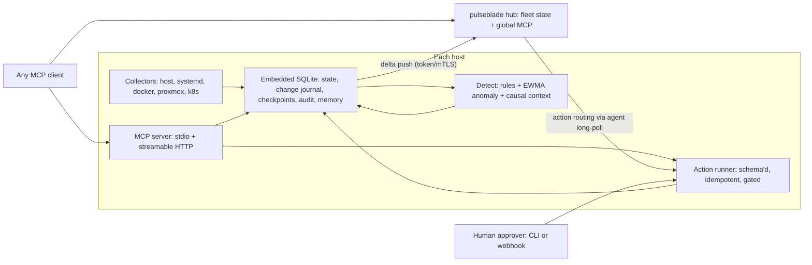

# Architecture

Pulseblade is one binary with three modes:

| Mode | Role |
|------|------|
| `pulseblade agent` | Runs collectors on a host, writes the local store, serves MCP over streamable HTTP |
| `pulseblade mcp` | Serves MCP over stdio against the local store (collects in-process if no agent holds the collector lock) |
| `pulseblade hub` | (M5) Aggregates many agents into fleet state and a global MCP endpoint |
| `pulseblade ctl` | Shell access to the same queries: snapshot, checkpoint, changes, export; later `approve` |

Agents never need inbound ports in fleet mode: they push deltas to the hub and long-poll it for actions.

## Crates

| Crate | Responsibility |
|-------|----------------|
| `pulseblade-core` | Schema types (`Resource`, `Sample`, `Change`, `Checkpoint`, `Finding`, `ActionSpec`, `ActionRun`, `Note`), label matching, duration parsing. Every type derives `JsonSchema`. |
| `pulseblade-store` | SQLite (`rusqlite`, bundled, WAL). Resource state, append-only change journal, checkpoints, samples with retention and query-time downsampling. |
| `pulseblade-collect` | `Collector` trait plus host (`sysinfo`) and systemd collectors. Docker, Proxmox, and Kubernetes arrive behind Cargo features. |
| `pulseblade-detect` | (M2) Threshold rules and EWMA anomaly detection producing findings with causal context. |
| `pulseblade-act` | (M3) Action registry, risk tiers, dry-run plans, approval gate, hash-chained audit. |
| `pulseblade-mcp` | `rmcp` server exposing the tool surface over stdio and streamable HTTP. |
| `pulseblade` | CLI binary, agent loop, config loading. |

## Data model

- **Resource** — anything observable. Ids are stable and hierarchical by convention: `host:<hostname>`, `disk:<hostname>:<mount>`, `net:<hostname>:<iface>`, `unit:<hostname>:<unit>`. Each carries `kind`, `labels` (semantic, from collectors and config), `attrs` (slow-moving state facts that are change-tracked), and an optional `parent`.
- **Sample** — `(resource, metric, ts, value)`. Fast-moving numbers live here, not in `attrs`, so they never generate change noise.
- **Change** — append-only journal entry with a monotonically increasing `seq`: `appeared`, `disappeared`, or `attr_changed` with `before`/`after`.
- **Checkpoint** — a name bound to a `seq`. `changes_since` accepts a checkpoint name, `seq:<n>`, an RFC 3339 timestamp, or a relative duration like `15m`.

Collectors report the full set of resources they own on each pass. The store diffs that set against the previous one to produce changes, so disappearance is detected without collector-side bookkeeping.

## Concurrency

Only one process collects per database. Collection takes an exclusive lock on `<db>.lock`; `pulseblade mcp` collects only if the lock is free, otherwise it reads the database a running agent maintains. SQLite runs in WAL mode so readers never block the collector.

## Response design for agents

- Every response includes `as_of_seq`, so an agent can use it directly as the next `changes_since` cursor.
- Lists are bounded (`limit`), ordered by relevance (unhealthy first), and report `truncated` with totals.
- Time series are capped at 300 points; the step widens automatically when needed.
