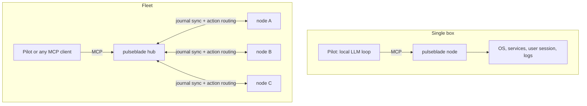
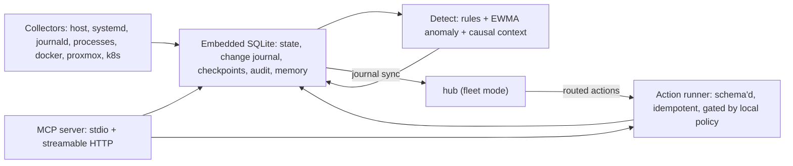

# Architecture

## Roles

Pulseblade separates three roles that "agent" would otherwise blur:

| Role | What it is | Command |
|------|------------|---------|
| **Node** | Per-host daemon: collectors, local store and change journal, action runner, MCP server, read-only HTTP view (dashboard, JSON API, Prometheus) | `pulseblade node` (stdio: `pulseblade mcp`) |
| **Hub** | Control node: consumes every node's journal into fleet state and serves the same MCP tools fleet-wide (M6) | `pulseblade hub` |
| **Pilot** | Optional reasoning loop: an MCP client driven by any OpenAI-compatible model endpoint, local or remote, that investigates findings and proposes actions (M4) | `pulseblade pilot` |

`pulseblade ctl` gives shell access to the same queries (`status`, snapshot, checkpoint, changes, export; later `approve`).

The pilot is optional and replaceable: Cursor, HolmesGPT, agent runtimes such as Hermes Agent, or a custom script can use the same tools. The monitor never embeds a model, and nothing in the basic view needs one.

## Topologies



### Invariants

1. **One MCP contract at every tier.** A pilot written against a single node works unchanged against a hub. Resource ids already carry the hostname (`unit:<host>:<unit>`); the hub only adds fleet-level tools on top (`fleet_overview`).
2. **Nodes own their policy.** The hub may plan and route an action, but the node evaluates it against its own risk tiers and allow-lists before running it. A compromised hub or confused pilot can never exceed what each node permits. Approval can happen at either tier.
3. **Journals are the replication protocol.** Each node's change journal is append-only with monotonic `seq`. The hub keeps a per-node cursor and consumes changes after it; a disconnected node keeps journaling locally and the hub catches up on reconnect.
4. **Nodes need no inbound ports.** Nodes connect out to the hub to push journal entries and samples and to long-poll for routed actions.
5. **Pilots are event-driven.** On a single box the LLM competes for the CPU, GPU, and memory it observes, so the pilot wakes on findings (and on a slow heartbeat), not on every collection pass.

### Scaling the context window

A fleet of 100 nodes with ~150 resources each is ~15,000 resources. The hub's `fleet_overview` groups by semantic labels (`role`, `cluster`, `criticality`) and host, reports unhealthy items in full, and summarizes the rest as counts. Labels are therefore load-bearing in fleet mode, not decoration.

A hub can present itself as a node to a higher hub, so hub-of-hubs needs no new protocol when it is eventually needed.

## Node internals



## Crates

| Crate | Responsibility |
|-------|----------------|
| `pulseblade-core` | Schema types (`Resource`, `Sample`, `Change`, `Checkpoint`, `Finding`, `ActionSpec`, `ActionRun`, `Note`), label matching, duration parsing. Every type derives `JsonSchema`. |
| `pulseblade-store` | SQLite (`rusqlite`, bundled, WAL). Resource state, append-only change journal, checkpoints, samples with retention and query-time downsampling. |
| `pulseblade-collect` | `Collector` trait plus host (`sysinfo`) and systemd collectors; journald, processes, and user units next. Docker, Proxmox, and Kubernetes arrive behind Cargo features. |
| `pulseblade-detect` | (M2) Threshold rules and EWMA anomaly detection producing findings with causal context. |
| `pulseblade-act` | (M3) Action registry, node-local risk tiers, dry-run plans, approval gate, hash-chained audit. |
| `pulseblade-mcp` | Shared query layer (`query.rs`), the `rmcp` tool surface over stdio and streamable HTTP, and the node's read-only HTTP surface: JSON API, Prometheus exposition, embedded dashboard. |
| `pulseblade-pilot` | (M4) Event-driven reasoning loop over MCP using an OpenAI-compatible model endpoint. |
| `pulseblade` | CLI binary, node loop, config loading. |

## Data model

- **Resource** — anything observable. Ids are stable and hierarchical by convention: `host:<hostname>`, `disk:<hostname>:<mount>`, `net:<hostname>:<iface>`, `unit:<hostname>:<unit>`. Each carries `kind`, `labels` (semantic, from collectors and config), `attrs` (slow-moving state facts that are change-tracked), and an optional `parent`.
- **Sample** — `(resource, metric, ts, value)`. Fast-moving numbers live here, not in `attrs`, so they never generate change noise.
- **Change** — append-only journal entry with a monotonically increasing `seq`: `appeared`, `disappeared`, or `changed` with `before`/`after`.
- **Checkpoint** — a name bound to a `seq`. `changes_since` accepts a checkpoint name, `seq:<n>`, an RFC 3339 timestamp, or a relative duration like `15m`.

Collectors report the full set of resources they own on each pass. The store diffs that set against the previous one to produce changes, so disappearance is detected without collector-side bookkeeping.

## Concurrency

Only one process collects per database. Collection takes an exclusive lock on `<db>.lock`; `pulseblade mcp` collects only if the lock is free, otherwise it serves the database a running node maintains. SQLite runs in WAL mode so readers never block the collector.

## Self-observability

Every collector pass is recorded in a `collector_runs` table (source, time, duration, ok/error, resource, sample, and change counts, configured interval; the last 240 runs per source are kept). Because it lives in the store, any process reading the database (the node, `pulseblade mcp`, `pulseblade ctl`) can judge collector health. A collector is **stale** after three intervals (at least 60 s) without a pass. Health surfaces in four places: the `collectors` block of `state_snapshot`, `/api/v1/status`, `pulseblade_collector_*` Prometheus series, and `ctl status`.

## HTTP surface

`pulseblade node` serves one axum router on its listen address (loopback by default):

- `/mcp` — MCP streamable HTTP.
- `/api/v1/*` — JSON API: `status`, `snapshot`, `resources/{id}`, `metrics`, `changes`, `checkpoints`. Handlers call the same `query` functions as the MCP tools; errors are `{error}` with 400 or 404.
- `/metrics` — Prometheus text exposition 0.0.4. Resource health is encoded 0 ok, 1 unknown, 2 degraded, 3 failed.
- `/` — a single self-contained HTML page (`include_str!`, vanilla JS, no CDN or build step) that polls the JSON API.

A Host-header allow-list (loopback, the listen address, and `allowed_hosts`) guards every route against DNS rebinding. There is no built-in authentication; remote access goes through a reverse proxy that adds TLS and auth.

## Response design for agents

- Every response includes `as_of_seq`, so an agent can use it directly as the next `changes_since` cursor.
- Lists are bounded (`limit`), ordered by relevance (unhealthy first), and report `truncated` with totals.
- Time series are capped at 300 points; the step widens automatically when needed.

## Token efficiency

Tokens are the agent's scarcest resource, so defaults are small and detail is opt-in:

1. **Summary first.** `state_snapshot` without filters returns counts by kind, collector health, host key metrics, and only unhealthy resources (with attributes). `detail=brief` lists every matching resource; `detail=full` adds all labels and attributes. Filters default to `brief`.
2. **Cursors, not re-reads.** Every response carries `as_of_seq`. `changes_since seq:<n>` returns only the delta, and `state_snapshot if_changed_since=<n>` returns `{as_of_seq, unchanged: true}` (about 8 tokens) when the journal has not moved. Failing or stale collectors still appear in that response.
3. **No redundancy.** Summary and brief entries drop the `host` label and a `name` that repeats the id (`unit:web1:sshd.service`); full detail, `resource_explain`, and export keep them. Zero failure counts are omitted.
4. **Compact encodings.** `metrics_query` returns `start`, `step_secs`, and a `values` array (null for empty buckets) instead of timestamped objects, targeting ~120 points by default with the step no finer than the collection interval. `changes_since` omits per-change `ts` by default and reports `first_ts`/`last_ts` for the set (`compact: false` restores it).
5. **Drill down only on change.** `resource_explain` and `metrics_query` are for the few resources that changed or are unhealthy; `export_bulk` is for offline analysis.

Measured with `cargo test -p pulseblade-mcp --test token_budget -- --nocapture` (approximate tokens as JSON characters / 4) against a realistic host: 1 host, 10 disks, 7 interfaces, 130 services (one failed), an hour of 15 s samples, ~610 journal entries:

| Response | Before | After |
|----------|-------:|------:|
| `state_snapshot` default | 2,037 | 154 (summary) |
| `state_snapshot` brief (previous default behavior) | 2,037 | 1,380 |
| `state_snapshot` full (was `verbose`) | 3,499 | 3,507 |
| `state_snapshot kind=service limit=500` | 4,558 | 2,598 |
| `state_snapshot if_changed_since` (unchanged) | — | 8 |
| `metrics_query` 1 h default | 2,649 | 207 |
| `changes_since` 100 changes | 4,632 | 3,851 (compact) / 4,651 (`compact: false`) |
| `resource_explain` service / host | 396 / 369 | 396 / 353 |
| `export_bulk` resources | 16,379 | 16,379 |

The test fails if the summary snapshot exceeds 600 tokens, the unchanged response 20, or the default 1 h series 600.

## Pilot (planned, M4)

The pilot ([#6](https://github.com/DataKnifeAI/pulseblade/issues/6)) is an optional MCP client with a model behind it. Nothing below is implemented yet.

### One provider interface

The pilot speaks a single protocol: **OpenAI-compatible Chat Completions with tool calling**. An endpoint is configured by `base_url`, `model`, `api_key_env` (the *name* of an environment variable holding the key; keys never live in config), and optional extra `headers`. That one interface covers local and remote backends; upstream products appear here only as integration examples, never in Pulseblade type or config names (the provider kind is `openai_compatible`).

| Example backend | `base_url` | Key |
|-----------------|-----------|-----|
| Ollama | `http://localhost:11434/v1` | none |
| vLLM | `http://<host>:8000/v1` | optional |
| OpenRouter | `https://openrouter.ai/api/v1` | `OPENROUTER_API_KEY` |
| Hermes models (served via vLLM or Ollama) | as above | as above |

External agent runtimes such as Hermes Agent do not need the pilot at all: they can consume Pulseblade directly as an MCP server (stdio or `/mcp`).

### Tiered routing

- **Triage** on a cheap local model: is this finding noise, known, or worth investigating?
- **Escalation** (optional) to a stronger, possibly remote model when triage says so or the triage budget runs out.
- **Fallback**: each tier is an ordered list of endpoints; if one is down or errors, the next is tried.
- **Local-only mode** for air-gapped hosts: remote endpoints are refused even if configured.

### Token strategy

- **Zero LLM calls at steady state.** The pilot wakes on new findings or journal changes (and a slow heartbeat), never per collection pass.
- **Deterministic pre-digestion in Rust.** Findings already carry causal context (recent changes on the resource, its parent, and its dependencies), so the first prompt is small and specific.
- **Start from summaries and cursors.** Summary snapshot, `changes_since` from the last seen `as_of_seq`, `if_changed_since` on re-checks.
- **Cap tool outputs** (limits, `detail=brief` at most, short `metrics_query` ranges) and truncate anything that still exceeds a per-call ceiling.
- **Budgets per investigation:** max tool calls, tokens, and wall time; token usage reported by the endpoint is recorded per run.
- **Prompt-cache friendly:** a stable system prompt and tool definitions first, variable context last.
- **Memory over re-derivation:** prior investigation notes on a resource are loaded before re-investigating it.

### Example configuration (planned; not yet parsed)

```toml
[pilot]
enabled = true
local_only = false
wake_on = ["findings", "changes"]
heartbeat_secs = 900

[pilot.budget]
max_tool_calls = 12
max_tokens = 20000
max_wall_secs = 120

[[pilot.tiers]]
name = "triage"
[[pilot.tiers.endpoints]]
kind = "openai_compatible"
base_url = "http://localhost:11434/v1"   # e.g. Ollama
model = "qwen3:8b"

[[pilot.tiers]]
name = "escalate"
[[pilot.tiers.endpoints]]
kind = "openai_compatible"
base_url = "http://gpu1:8000/v1"         # e.g. vLLM serving a Hermes model
model = "NousResearch/Hermes-4-70B"
[[pilot.tiers.endpoints]]                 # fallback if gpu1 is down
kind = "openai_compatible"
base_url = "https://openrouter.ai/api/v1"
model = "anthropic/claude-sonnet-4.5"
api_key_env = "OPENROUTER_API_KEY"
headers = { "X-Title" = "pulseblade" }
```
